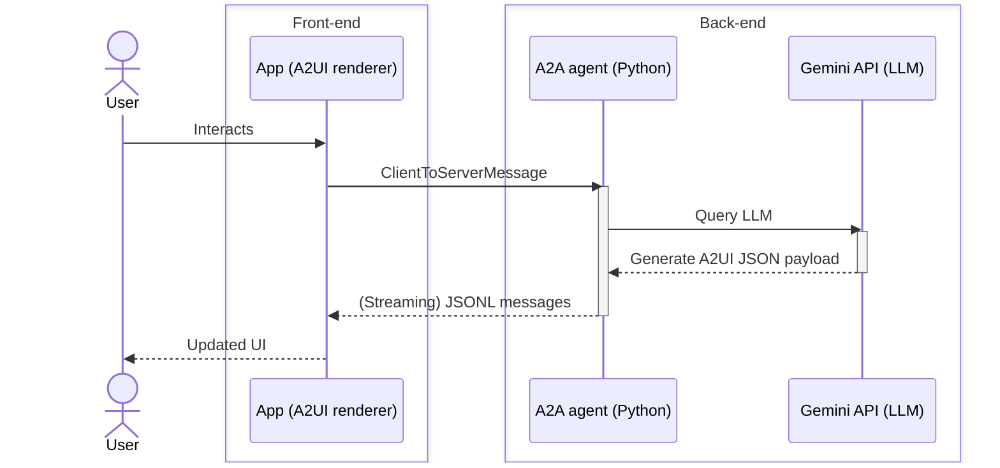

# Quickstart: Run A2UI in 5 Minutes

Get hands-on with A2UI by running the restaurant finder demo. This guide will have you experiencing agent-generated UI in less than 5 minutes.

## What You'll Build

By the end of this quickstart, you'll have:

- A running app with an A2UI renderer (Lit or Flutter).
- A Gemini-powered agent that generates dynamic UIs.
- An interactive restaurant finder with form generation, time selection, and confirmation flows.
- Understanding of how A2UI messages flow from agent to UI.

## Prerequisites

Before you begin, choose your client framework:

=== "Lit"

    - **Node.js** (v18 or later with [Corepack](https://nodejs.org/api/corepack.html) enabled) — [Download here](https://nodejs.org/)

=== "Flutter"

    - **Flutter SDK** — [Install here](https://docs.flutter.dev/install)

**Common Prerequisites:**

- **uv** (Python package manager) — [Install here](https://docs.astral.sh/uv/getting-started/installation/) (used to run the Python agent backend)
- **A Gemini API key** — [Get one free from Google AI Studio](https://aistudio.google.com/apikey)

> [!WARNING]
> **Security Notice**
>
> This demo runs an A2A agent that uses Gemini to generate A2UI responses. The agent has access to your API key and will make requests to Google's Gemini API. Always review agent code before running it in production environments.

## Step 1: Clone the Repository

```bash
git clone https://github.com/a2ui-project/a2ui.git
cd a2ui
```

## Step 2: Set Your API Key

Export your Gemini API key as an environment variable:

```bash
export GEMINI_API_KEY="your_gemini_api_key_here"
```

## Step 3: Run the Agent and Client

=== "Lit"

    The client application source code is located in `samples/client/lit/shell`. Navigate to the parent samples directory to run the demo:

    ```bash
    cd samples/client/lit

    # Enable Corepack (macOS Homebrew users: see tip below)
    corepack enable

    yarn install
    yarn demo:restaurant
    ```

    ??? note "Running the agent and client separately"
        The `demo:restaurant` command runs both the A2A agent and the web client
        automatically. It is equivalent to:

        **1. Run the Agent:**

        ```bash
        cd samples/agent/adk/restaurant_finder
        uv run .
        ```

        **2. Run the Client:**

        ```bash
        cd samples/client/lit/shell
        yarn dev
        ```

    > [!INFO]
    > **About Package Managers:**
    >
    > The A2UI repository uses `yarn` for its development, but `yarn` is not
    > required to **use** A2UI. You may use the package manager of your choice
    > on your projects (e.g. `npm` or `pnpm`).

=== "Flutter"

    **1. Run the Agent:**

    In your first terminal, start the Python agent backend:

    ```bash
    cd samples/agent/adk/restaurant_finder
    uv run .
    ```

    **2. Run the Client:**

    In a second terminal, launch the Flutter web application:

    ```bash
    cd samples/client/flutter/restaurant_finder/app
    flutter run -d chrome
    ```

> [!TIP]
> **Demo Running**
>
> If everything worked, you should see the demo app. The agent is now ready to
> generate UI!

## Step 4: Try It Out

In the web app, try these prompts:

1. **"Book a table for 2"** - Watch the agent generate a reservation form
2. **"Find Italian restaurants near me"** - See dynamic search results
3. **"What are your hours?"** - Experience different UI layouts for different intents

The demo application should update after each response from the agent, with UI
completely generated by the Gemini LLM. **The resulting screens (list of restaurants,
reservation flow, reservation confirmation...) are not hardcoded in the source
of the app.**

---

## How does it work?

Let's dive deeper into how this demo app is put together, and how you can build similar applications with A2UI.

### Interaction sequence diagram



1. **User interacts** with your app (sends a message, clicks a button, etc.)
2. **The A2A agent** receives it and sends the conversation to Gemini
3. **Gemini generates A2UI JSON** messages describing the UI
4. **The A2A agent** streams these messages back to the app
5. **The A2UI renderer** converts them into UI components
6. **Your app UI updates**

### The A2UI JSON payloads

Let's peek at what the agent is returning. Here's a simplified example of the JSON messages:

=== "v0.9"

    **Creating the surface:**

    ```json
    { "version": "v0.9.1",
      "createSurface": {
        "surfaceId": "main",
        "catalogId": "https://a2ui.org/specification/v0_9_1/catalogs/basic/catalog.json"
      }}
    ```

    **Defining the UI:**

    ```json
    { "version": "v0.9.1",
      "updateComponents": {
        "surfaceId": "main",
        "components": [
          {"id": "header", "component": "Text", "text": "# Book Your Table", "variant": "h1"},
          {"id": "date-picker", "component": "DateTimeInput", "label": "Select Date", "value": {"path": "/reservation/date"}, "enableDate": true},
          {"id": "submit-text", "component": "Text", "text": "Confirm Reservation"},
          {"id": "submit-btn", "component": "Button", "child": "submit-text", "variant": "primary", "action": {"event": {"name": "confirm_booking"}}}
        ]
      }}
    ```

    **Populating data:**

    ```json
    { "version": "v0.9.1",
      "updateDataModel": {
        "surfaceId": "main",
        "path": "/reservation",
        "value": {"date": "2025-12-15", "time": "19:00", "guests": 2}
      }}
    ```

=== "Legacy (v0.8)"

    **Defining the UI:**

    ```json
    {"surfaceUpdate": {"surfaceId": "main", "components": [
      {"id": "header", "component": {"Text": {"text": {"literalString": "Book Your Table"}, "usageHint": "h1"}}},
      {"id": "date-picker", "component": {"DateTimeInput": {"label": {"literalString": "Select Date"}, "value": {"path": "/reservation/date"}, "enableDate": true}}},
      {"id": "submit-text", "component": {"Text": {"text": {"literalString": "Confirm Reservation"}}}},
      {"id": "submit-btn", "component": {"Button": {"child": "submit-text", "action": {"name": "confirm_booking"}}}}
    ]}}
    ```

    **Populating data:**

    ```json
    {"dataModelUpdate": {"surfaceId": "main", "contents": [
      {"key": "reservation", "valueMap": [
        {"key": "date", "valueString": "2025-12-15"},
        {"key": "time", "valueString": "19:00"},
        {"key": "guests", "valueInt": 2}
      ]}
    ]}}
    ```

    **Signaling render:**

    ```json
    {"beginRendering": {"surfaceId": "main", "root": "header"}}
    ```

    Note: In v0.8, `createSurface` was `beginRendering`, components were nested
    in the response, and the data model used an adjacency list instead of
    flat JSON.

> [!TIP]
> **It's Just JSON**
>
> Notice how readable and structured this is? LLMs can generate this easily, and it's safe to transmit and render—**no code execution required.**

### Peek at the source code

Want to see what the code looks like? Check out:

- **Agent Code**: `samples/agent/adk/restaurant_finder/` — The Python A2A agent

=== "Lit"

    - **Client Code**: `samples/client/lit/` — The Lit web client with A2UI renderer
    - **A2UI Renderers**: `renderers/lit/` (Lit) and `renderers/web_core/` (framework-agnostic core)

=== "Flutter"

    - **Client Code**: `samples/client/flutter/` — The Flutter web client with A2UI renderer
    - **A2UI Renderer**: `renderers/flutter/` (Flutter)

Each directory has its own README with detailed documentation.

---

## Troubleshooting

=== "Lit"

    ### Port Already in Use

    If port 5173 is already in use, the dev server will automatically try the next available port. Check the terminal output for the actual URL.

    ### Corepack and Homebrew issues

    If you have standalone package managers installed, try to unlink conflicts before installing Corepack so Corepack can manage versions per-project:

    > ```bash
    > $ brew unlink yarn pnpm
    > $ brew install corepack
    > $ corepack enable
    > ```

=== "Flutter"

    <!--- Flutter demo troubleshooting advice can go here --->

### API Key Issues

If you see errors about missing API keys:

1. Verify the key is exported: `echo $GEMINI_API_KEY`
2. Make sure it's a valid Gemini API key from [Google AI Studio](https://aistudio.google.com/apikey)
3. Try re-exporting: `export GEMINI_API_KEY="your_key"`

### Connection Errors on Startup

If you see `ERR_CONNECTION_REFUSED` errors when the browser opens, **don't worry** — this is a known race condition. The web app may start faster than the Python agent backend. Just wait a few seconds and refresh the page.

### Python / uv Issues

The demo agents require [uv](https://docs.astral.sh/uv/) to run. If you see `uv: command not found`:

```bash
# Install uv
curl -LsSf https://astral.sh/uv/install.sh | sh

# Verify
uv --version
```

If you encounter other Python errors:

```bash
# Make sure Python 3.10+ is available
python3 --version

# Try running the agent manually
cd samples/agent/adk/restaurant_finder
uv run .
```

### Still Having Issues?

- Check the [GitHub Issues](https://github.com/a2ui-project/a2ui/issues)
- Review the sample README.md ([Lit](../../samples/client/lit) or [Flutter](../../samples/client/flutter))
- Join the community discussions

---

## Exploring more demos

=== "Lit"

    ### Lit Component Gallery (No Agent Required)

    See all the provided Basic Catalog components:

    If you're running the gallery from a fresh checkout, build the gallery and its workspace dependencies first:

    ```bash
    cd renderers/lit/a2ui_explorer
    yarn build
    ```

    Start the gallery:

    ```bash
    yarn dev
    ```

    This runs a client-only demo showcasing every standard component (Card, Button, TextField, Timeline, etc.) with live examples and code samples.

=== "Flutter"

    <!--- Additional Flutter specific client samples can go here. --->

### Other Languages and Frameworks

A2UI provides samples for other popular frameworks in the `samples/client` directory:

- **Angular**: `samples/client/angular`
- **Flutter**: `samples/client/flutter`
- **Lit**: `samples/client/lit`
- **React**: `samples/client/react`

Explore the [samples/client](../../samples/client) directory to see all available client implementations.

---

## What's Next?

**Congratulations!** You've successfully run your first A2UI application. You've seen how an AI agent can generate rich, interactive UIs that render natively in a web application—all through safe, declarative JSON messages.

Check out the following links to learn more:

- **[Learn Core Concepts](concepts/overview.md)**: Understand surfaces, components, and data binding
- **[Build an Agent](guides/agent-development.md)**: Create agents that generate A2UI responses
- **[Set Up Your Own Client](guides/client-setup.md)**: Integrate A2UI into your own app
- **[Define Your Own Catalog](guides/defining-your-own-catalog.md)**: Move past the Basic Catalog, and control the UI elements used to generate your app
- **[Use an Existing Agent App](guides/a2ui-with-any-agent-framework.md)**: Add A2UI through CopilotKit + AG-UI for ADK, LangGraph, CrewAI, Mastra, or a custom service
- **[Explore the Protocol](reference/messages.md)**: Dive into the technical specification
